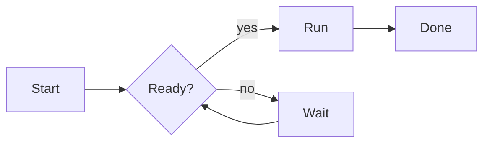
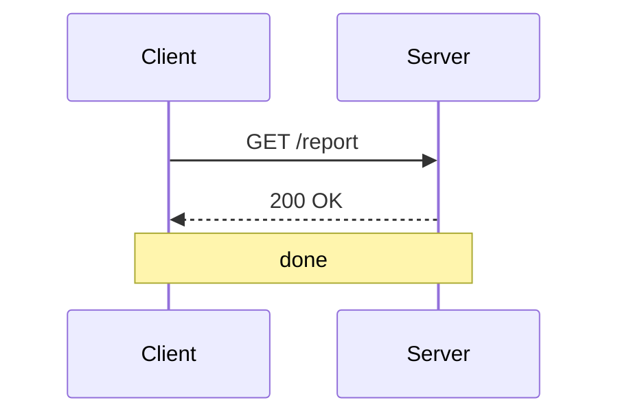
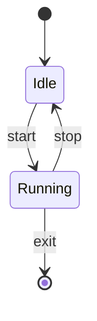
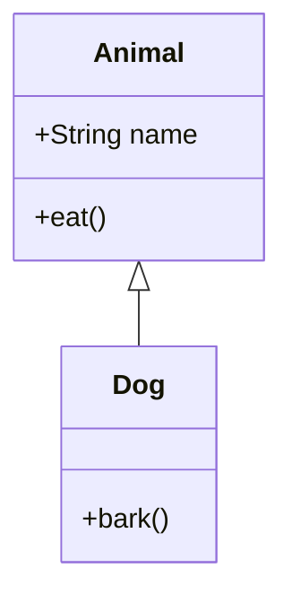

# md

`md` is a standalone terminal **Markdown viewer** that renders Markdown with
terminal styling (bold, italic, links, code, tables), **syntax highlights**
fenced code blocks, and draws ` ```mermaid ` code fences as **ASCII diagrams** —
flowcharts, sequence, state, and class diagrams.

It has **no dependencies**: only the Go standard library.

```
$ md README.md

# md

This is bold, italic, and inline code. See the docs.

        +-------+
        | Start |
        +-------+
            |
            v
         .-----.
         < OK? >
         '-----'
            ^
    +- yes -+
    |       + no +
    |       +----+
    v            v
+------+     +-------+
| Done |     | Debug |
+------+     +-------+
```

## Features

- Terminal Markdown rendering: headings, **bold**, *italic*, `inline code`,
  links, raw URLs, lists, and aligned tables.
- Simple word wrapping to the terminal width (or an explicit `-w`).
- Syntax highlighting for tagged code fences in around two dozen languages —
  Go, Rust, C, C++, Java, Kotlin, Swift, C#, JavaScript, TypeScript, PHP,
  Python, Ruby, shell, SQL, Lua, JSON, YAML, TOML, HTML, CSS, Dockerfile,
  Makefile and unified diffs. Untagged and unrecognized fences are left as
  written, and highlighting only adds color, so code stays copy-pasteable.
- ` ```mermaid ` fences rendered as ASCII art:
  - **Flowcharts** (`flowchart` / `graph`, TD/BT/LR/RL)
  - **Sequence diagrams** (`sequenceDiagram`)
  - **State diagrams** (`stateDiagram` / `stateDiagram-v2`)
  - **Class diagrams** (`classDiagram`)
- Unrenderable diagrams fall back to a plain code fence instead of failing.
- Automatic color detection (TTY-aware) with `-color auto|always|never`.
- Interactive paging through `less` (or your `$PAGER`), with `-p auto|always|never`.
- Reads files or standard input.

## Install

### macOS

Install with Homebrew:

```sh
brew tap ClarifiedLabs/tap
brew install md
```

<!-- release-artifacts:start -->
Or download the latest release, v0.0.2, directly:

- Apple silicon (arm64): [signed `.pkg`](https://github.com/ClarifiedLabs/mdcli/releases/download/v0.0.2/md_v0.0.2_darwin_arm64.pkg) · [`.tar.gz`](https://github.com/ClarifiedLabs/mdcli/releases/download/v0.0.2/md_v0.0.2_darwin_arm64.tar.gz)
- Intel (amd64): [`.tar.gz`](https://github.com/ClarifiedLabs/mdcli/releases/download/v0.0.2/md_v0.0.2_darwin_amd64.tar.gz)

### Linux

v0.0.2 is available for amd64/x86_64 and arm64/aarch64:

| Format | amd64 / x86_64 | arm64 / aarch64 |
|---|---|---|
| Package | [`.deb`](https://github.com/ClarifiedLabs/mdcli/releases/download/v0.0.2/md_0.0.2_amd64.deb) · [`.rpm`](https://github.com/ClarifiedLabs/mdcli/releases/download/v0.0.2/md-0.0.2-1.x86_64.rpm) | [`.deb`](https://github.com/ClarifiedLabs/mdcli/releases/download/v0.0.2/md_0.0.2_arm64.deb) · [`.rpm`](https://github.com/ClarifiedLabs/mdcli/releases/download/v0.0.2/md-0.0.2-1.aarch64.rpm) |
| Tarball | [`.tar.gz`](https://github.com/ClarifiedLabs/mdcli/releases/download/v0.0.2/md_v0.0.2_linux_amd64.tar.gz) | [`.tar.gz`](https://github.com/ClarifiedLabs/mdcli/releases/download/v0.0.2/md_v0.0.2_linux_arm64.tar.gz) |

Every asset is listed with its SHA-256 in
[`checksums.txt`](https://github.com/ClarifiedLabs/mdcli/releases/download/v0.0.2/checksums.txt).
<!-- release-artifacts:end -->

### From source

```sh
go install github.com/ClarifiedLabs/mdcli/cmd/md@latest
```

## Usage

```
md [flags] [file...]
```

With no file arguments, Markdown is read from standard input.

```
Flags:
  -w, -width int    wrap width in columns (0 = auto)
  -color string     color output: auto, always, or never (default "auto")
  -p, -pager string page output through a pager: auto, always, or never (default "auto")
  -version          print version information and exit
  -h, -help         show this help
```

### Pager

When stdout is a terminal, `md` pipes its output through a pager so long
documents can be scrolled and searched. The pager is resolved in this order:

1. **`$PAGER`** — used verbatim (it may include arguments, e.g. `PAGER="less -S"`).
2. **`less`** — invoked as `less -FRX` (quit if one screen, keep colors, no
   alternate screen) unless the `LESS` environment variable is set, in which
   case `LESS` is respected entirely and no flags are injected.
3. **`more`** — run verbatim with no injected flags.

If none is found, or the pager fails to start, output is written directly to
stdout. When stdout is not a terminal (a pipe or redirect), no pager is ever
used, so `md` stays composable in scripts. Use `-p never` to disable paging
unconditionally.

### Examples

```sh
md README.md                 # render a file
md -w 100 notes.md           # wrap at 100 columns
cat doc.md | md              # read from stdin
md -color never doc.md > out.txt   # strip styling for a plain file
md -p never long-doc.md      # render without a pager
PAGER="less -S" md wide.md   # page through less with chopped lines
```

## Mermaid examples

A few small diagrams you can drop into any Markdown file and render with
`md`. Each ` ```mermaid ` fence is drawn as ASCII art.

For a full tour of everything `md` renders — text formatting and document
structure as well as each diagram type — see the [examples](examples/)
directory:

```sh
md examples/01-text-formatting.md
```

### Flowchart



### Sequence diagram



### State diagram



### Class diagram



## Building from source

```sh
git clone https://github.com/ClarifiedLabs/mdcli
cd mdcli
go build -o md ./cmd/md
./md README.md
```

## How it works

The document is streamed line-by-line through a Markdown renderer. When a
` ```mermaid ` fence is encountered, its body is handed to the ASCII Mermaid
renderer and the resulting diagram is emitted in place of the fence. Every
other fenced code block passes through unchanged.

## License

MIT — see [LICENSE](LICENSE).
