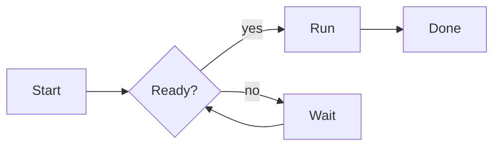
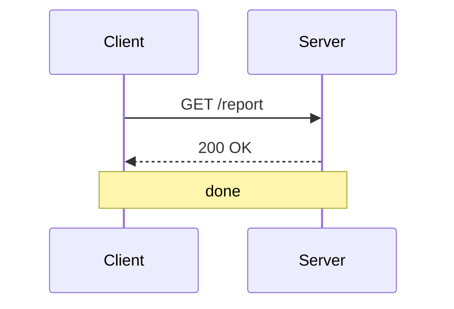
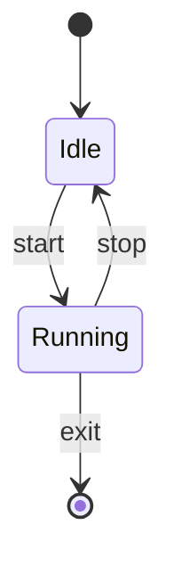
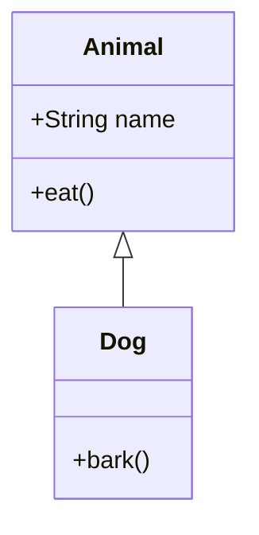

# md

`md` is a standalone terminal **Markdown viewer** that renders Markdown with
terminal styling (bold, italic, links, code, tables), **syntax highlights**
fenced code blocks, and draws ` ```mermaid ` code fences as **ASCII diagrams** —
flowcharts, sequence, state, and class diagrams.

It has **no dependencies**: only the Go standard library.

```
$ md README.md

# md

This is bold, italic, and inline code. See the docs.

        +-------+
        | Start |
        +-------+
            |
            v
         .-----.
         < OK? >
         '-----'
            ^
    +- yes -+
    |       + no +
    |       +----+
    v            v
+------+     +-------+
| Done |     | Debug |
+------+     +-------+
```

## Features

- Terminal Markdown rendering: headings, **bold**, *italic*, `inline code`,
  links, raw URLs, lists, and aligned tables.
- Responsive table layout and word wrapping to the terminal width (or an explicit `-w`): tables wrap cells to fit and fall back to a stacked `Label: value` view on very narrow terminals.
- Syntax highlighting for tagged code fences in around two dozen languages —
  Go, Rust, C, C++, Java, Kotlin, Swift, C#, JavaScript, TypeScript, PHP,
  Python, Ruby, shell, SQL, Lua, JSON, YAML, TOML, HTML, CSS, Dockerfile,
  Makefile and unified diffs. Untagged and unrecognized fences are left as
  written, and highlighting only adds color, so code stays copy-pasteable.
- ` ```mermaid ` fences rendered as ASCII art:
  - **Flowcharts** (`flowchart` / `graph`, TD/BT/LR/RL), adapted to the display width
    with label wrapping, optional rotation, and a readable list fallback
  - **Sequence diagrams** (`sequenceDiagram`)
  - **State diagrams** (`stateDiagram` / `stateDiagram-v2`)
  - **Class diagrams** (`classDiagram`)
- Unrenderable diagrams fall back to a plain code fence instead of failing.
- Automatic color detection (TTY-aware) with `-color auto|always|never` and `-theme dark|light|auto` (true-color dark/light palettes; `auto` inspects `MDCLI_THEME`, `COLORFGBG`, `TERM_BACKGROUND`).
- Interactive paging through `less` (or your `$PAGER`), with `-p auto|always|never`.
- Reads files or standard input.

## Install

### macOS

Install with Homebrew:

```sh
brew tap ClarifiedLabs/tap
brew install md
```

<!-- release-artifacts:start -->
Or download the latest release, v0.0.4, directly:

- Apple silicon (arm64): [signed `.pkg`](https://github.com/ClarifiedLabs/mdcli/releases/download/v0.0.4/md_v0.0.4_darwin_arm64.pkg) · [`.tar.gz`](https://github.com/ClarifiedLabs/mdcli/releases/download/v0.0.4/md_v0.0.4_darwin_arm64.tar.gz)
- Intel (amd64): [`.tar.gz`](https://github.com/ClarifiedLabs/mdcli/releases/download/v0.0.4/md_v0.0.4_darwin_amd64.tar.gz)

### Linux

v0.0.4 is available for amd64/x86_64 and arm64/aarch64:

| Format | amd64 / x86_64 | arm64 / aarch64 |
|---|---|---|
| Package | [`.deb`](https://github.com/ClarifiedLabs/mdcli/releases/download/v0.0.4/md_0.0.4_amd64.deb) · [`.rpm`](https://github.com/ClarifiedLabs/mdcli/releases/download/v0.0.4/md-0.0.4-1.x86_64.rpm) | [`.deb`](https://github.com/ClarifiedLabs/mdcli/releases/download/v0.0.4/md_0.0.4_arm64.deb) · [`.rpm`](https://github.com/ClarifiedLabs/mdcli/releases/download/v0.0.4/md-0.0.4-1.aarch64.rpm) |
| Tarball | [`.tar.gz`](https://github.com/ClarifiedLabs/mdcli/releases/download/v0.0.4/md_v0.0.4_linux_amd64.tar.gz) | [`.tar.gz`](https://github.com/ClarifiedLabs/mdcli/releases/download/v0.0.4/md_v0.0.4_linux_arm64.tar.gz) |

Every asset is listed with its SHA-256 in
[`checksums.txt`](https://github.com/ClarifiedLabs/mdcli/releases/download/v0.0.4/checksums.txt).
<!-- release-artifacts:end -->

### From source

```sh
go install github.com/ClarifiedLabs/mdcli/cmd/md@latest
```

## Usage

```
md [flags] [file...]
```

With no file arguments, Markdown is read from standard input.

```
Flags:
  -w, -width int    wrap width in columns (0 = auto)
  -color string     color output: auto, always, or never (default "auto")
  -theme string     syntax theme: dark, light, or auto (default "dark")
  -p, -pager string page output through a pager: auto, always, or never (default "auto")
  -version          print version information and exit
  -h, -help         show this help
```

### Width and flowcharts

`-w` / `-width` controls text wrapping, responsive tables, and adaptive Mermaid
flowcharts. Flowcharts that already fit without destructive label placements
are unchanged. Wider flowcharts can wrap node labels and rotate horizontal
layouts (`LR` → `TD`, `RL` → `BT`) to fit without wrapping completed ASCII art.
Complex diagrams or narrow displays use a readable list of nodes and connections
instead of squeezed ASCII art.
Sequence, state, and class diagrams, and ordinary fenced code blocks, are not
adapted to the width.

A larger `-w` can preserve a horizontal flowchart's orientation when it fits
without destructive label placements; `-w 120` does not guarantee that every
flowchart stays horizontal. Flowcharts always use the resolved display width;
there is no separate unlimited rendering mode.

### Pager

When stdout is a terminal, `md` pipes its output through a pager so long
documents can be scrolled and searched. The pager is resolved in this order:

1. **`$PAGER`** — used verbatim (it may include arguments, e.g. `PAGER="less -S"`).
2. **`less`** — invoked as `less -FRX` (quit if one screen, keep colors, no
   alternate screen) unless the `LESS` environment variable is set, in which
   case `LESS` is respected entirely and no flags are injected.
3. **`more`** — run verbatim with no injected flags.

If none is found, or the pager fails to start, output is written directly to
stdout. When stdout is not a terminal (a pipe or redirect), no pager is ever
used, so `md` stays composable in scripts. Use `-p never` to disable paging
unconditionally.

For content wider than your terminal, use horizontal scrolling:

```sh
PAGER='less -RS' md -w 120 ~/diagrams.md
```

`less -S` avoids folding long lines; scroll horizontally to see the hidden
columns. It does not make the entire diagram visible at once on a narrower
terminal. `-R` preserves terminal colors. The requested width still controls
flowchart adaptation before the pager displays the result.

### Examples

```sh
md README.md                 # render a file
md -w 100 notes.md           # wrap at 100 columns
cat doc.md | md              # read from stdin
md -color never doc.md > out.txt   # strip styling for a plain file
md -p never long-doc.md      # render without a pager
PAGER='less -RS' md -w 120 ~/diagrams.md  # scroll horizontally without folding lines
```

## Mermaid examples

A few small diagrams you can drop into any Markdown file and render with
`md`. Each ` ```mermaid ` fence is drawn as ASCII art.

For a full tour of everything `md` renders — text formatting and document
structure as well as each diagram type — see the [examples](examples/)
directory:

```sh
md examples/01-text-formatting.md
```

### Flowchart


```mermaid
flowchart LR
  A[Start] --> B{Ready?}
  B -->|yes| C[Run]
  B -->|no| D[Wait]
  D --> B
  C --> E[Done]
```

### Sequence diagram


```mermaid
sequenceDiagram
  participant C as Client
  participant S as Server
  C->>S: GET /report
  S-->>C: 200 OK
  Note over C,S: done
```

### State diagram


```mermaid
stateDiagram-v2
  [*] --> Idle
  Idle --> Running: start
  Running --> Idle: stop
  Running --> [*]: exit
```

### Class diagram


```mermaid
classDiagram
  class Animal {
    +String name
    +eat()
  }
  class Dog {
    +bark()
  }
  Animal <|-- Dog
```

### Mermaid safety limits

Rendering budgets are fixed and apply **per diagram**, not per document:

| Resource | Maximum |
| --- | --- |
| Source | 64 KiB, including comments and front matter |
| Graph nodes or sequence participants | 256 |
| Graph edges | 1,024, after expanding grouped links |
| Sequence events | 1,024 messages, notes, and block delimiters |
| Virtual layout nodes | 8,192, used to route edges across layers |
| Canvas width or height | 4,096 columns or rows |
| Canvas area | 1,000,000 cells, including whitespace |

State start/end markers count as nodes. Node lists, note participant lists
(including repeats), and composite-state nesting also have a 256-entry limit.
Canvas budgets include front-matter titles. Flowchart lists share these size
budgets and have a 4,000,000-byte output cap, including their titles. On a
one-column display, an indivisible double-width glyph is kept intact.
Tabs are expanded to four spaces;
both raw and normalized source must fit the source budget.

If a budget is exceeded, `md` shows the reason followed by the source code fence,
not a partial diagram. Unsupported diagrams still fall back to source without a
limit warning. Mermaid content is stripped of terminal control characters in
all color modes, including titles and source fallbacks.

## Building from source

```sh
git clone https://github.com/ClarifiedLabs/mdcli
cd mdcli
go build -o md ./cmd/md
./md README.md
```

## How it works

The document is streamed line-by-line through a Markdown renderer. When a
` ```mermaid ` fence is encountered, its body is handed to the ASCII Mermaid
renderer along with the display width. The resulting diagram, or a flowchart's
node-and-connection list fallback, is emitted directly in place of the fence;
labels are not reparsed as Markdown. Other diagram kinds keep their layout, and
every other fenced code block passes through unchanged.

## License

MIT — see [LICENSE](LICENSE).
