# Flowcharts

Flowcharts are written as `flowchart` or `graph`, followed by a direction.

## Directions

`TD` (top-down, the default) and `BT` stack ranks vertically:

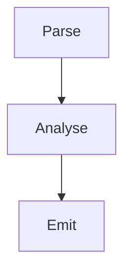

`LR` and `RL` lay them out horizontally:

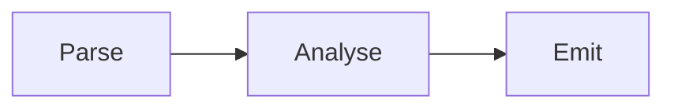

Bottom-up, useful for dependency graphs where the leaves come first:

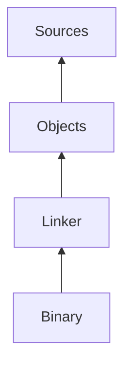

## Node shapes

Every shape Mermaid's flowchart syntax offers:

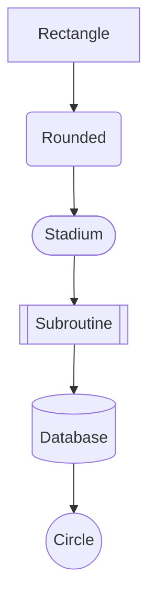

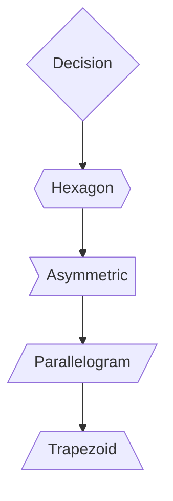

The slanted shapes come in both leanings — `[/text/]` and `[\text\]` for
parallelograms, `[/text\]` and `[\text/]` for trapezoids:

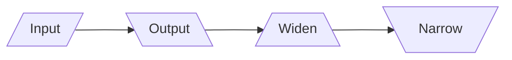

## Edge styles

Solid, dotted and thick lines, with and without arrowheads:

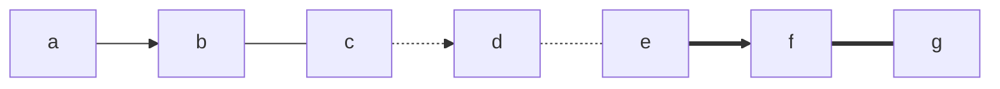

Alternative arrowheads, and arrows at both ends:

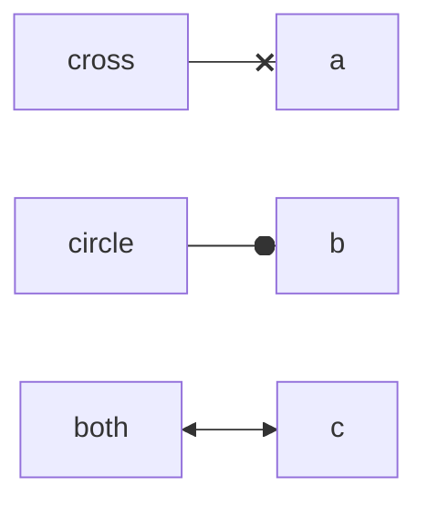

An invisible link (`~~~`) influences layout but draws nothing, which is handy
for nudging nodes into place:

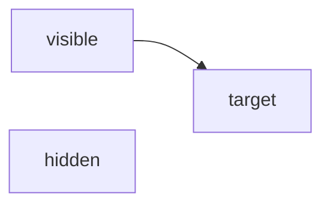

## Edge labels

Labels attach either in pipes after the arrow or inline within it:

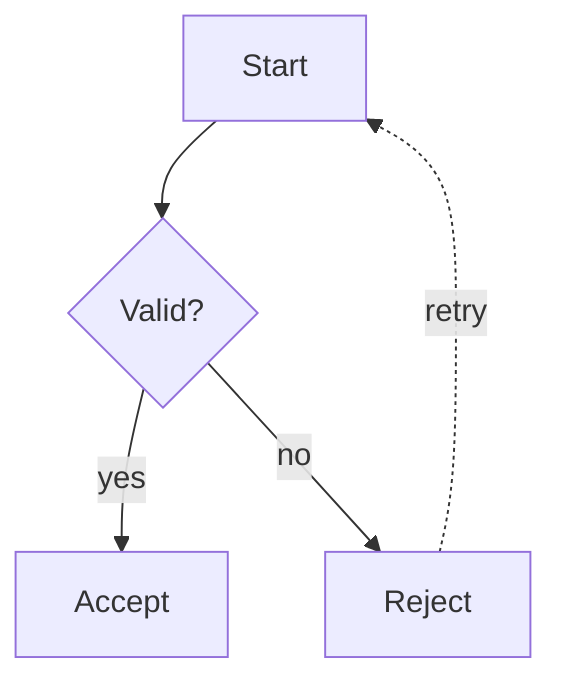

## Chains and groups

Several nodes can be linked in one statement, and `&` applies a link to a
whole group at once:

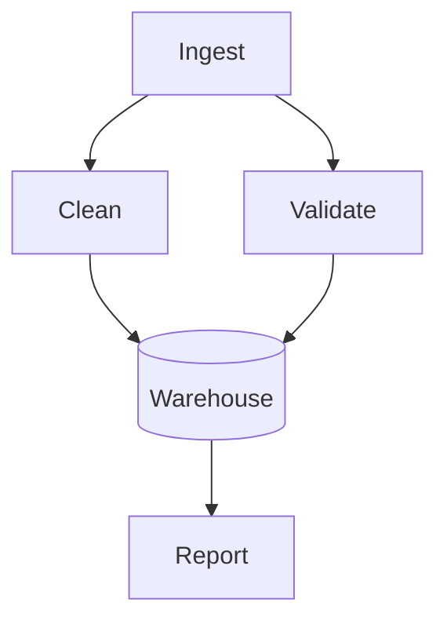

Statements may also be separated with semicolons on a single line:

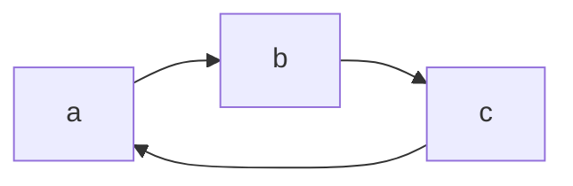

## Labels

Quote a label to use characters that would otherwise end it, break lines with
` `, and write reserved characters as HTML entities:

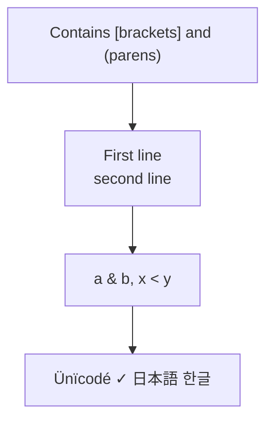

Double-width characters are measured in terminal columns, so boxes around CJK
text line up correctly.

## Subgraphs and styling

`subgraph` blocks are flattened — their nodes are drawn, the grouping box is
not. Styling statements (`style`, `classDef`, `class`, `linkStyle`, `click`)
are parsed and ignored, so diagrams copied from a web page still render:

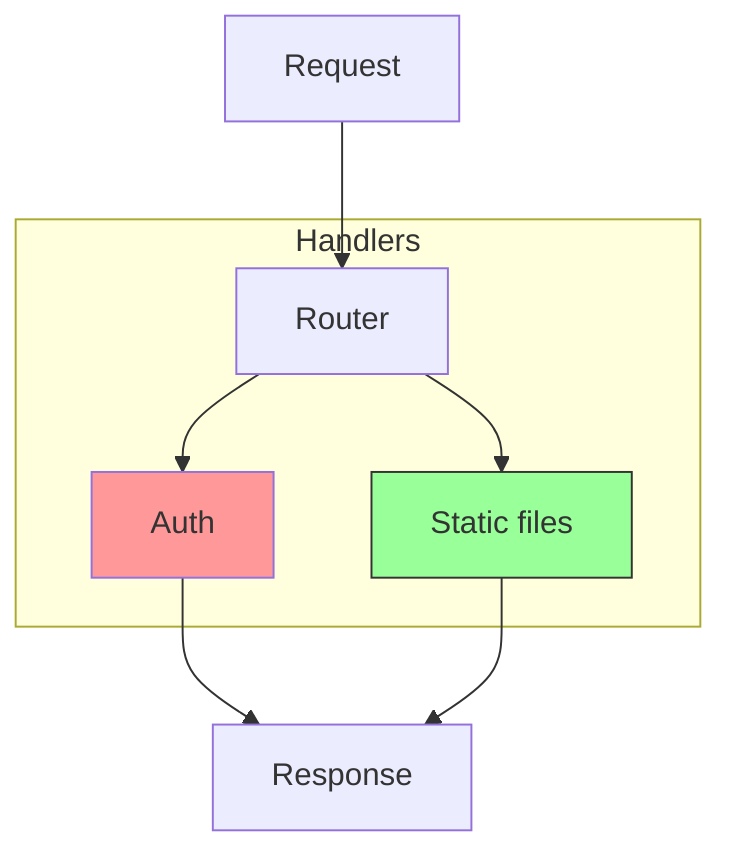

## Cycles and self-loops

Cycles are broken automatically so ranks can be assigned, and arrows still
point the right way. A node may also link to itself:

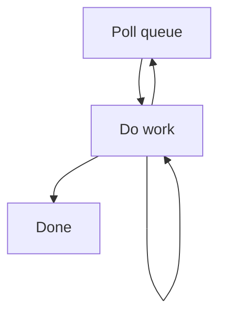

## Titles

A YAML front matter block sets a title, which is centered above the diagram.
Init directives are stripped:

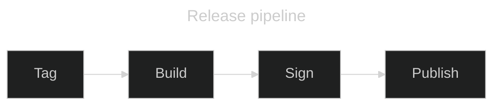
