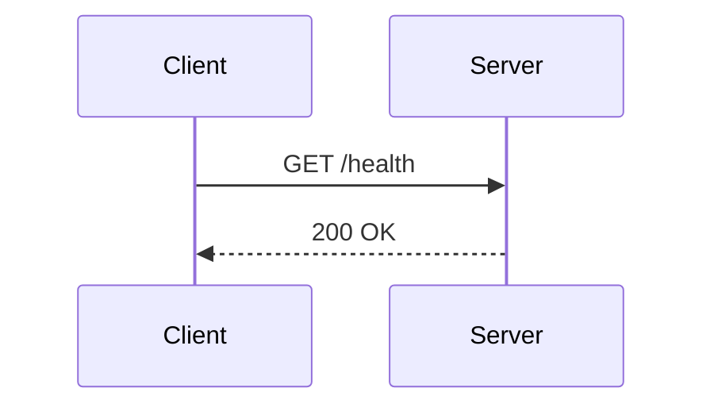
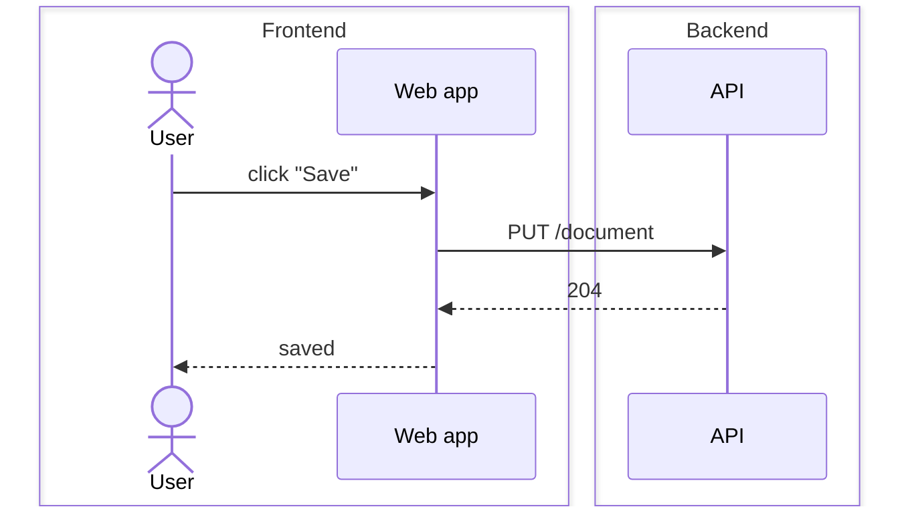
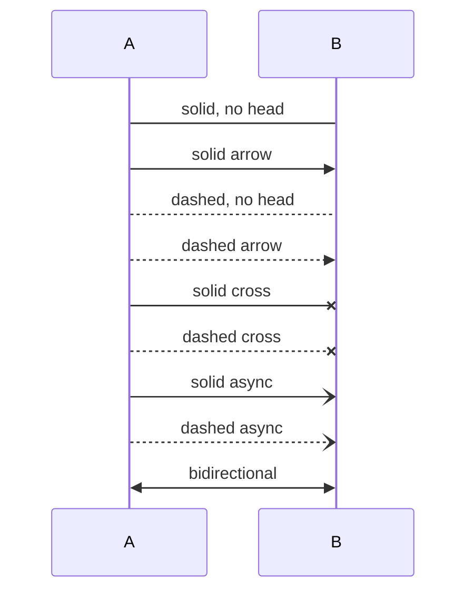
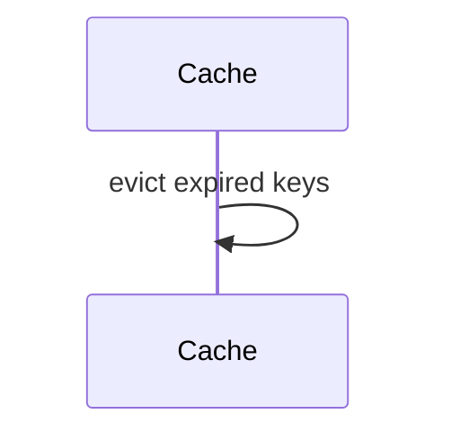
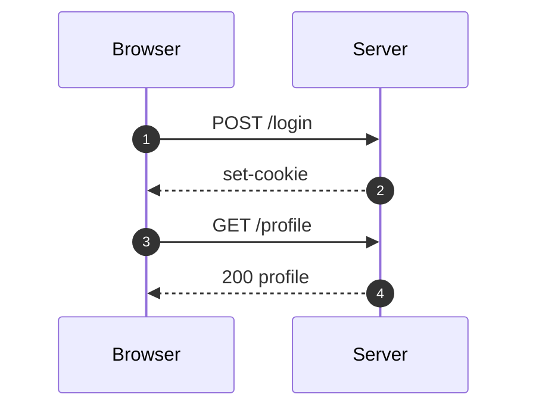
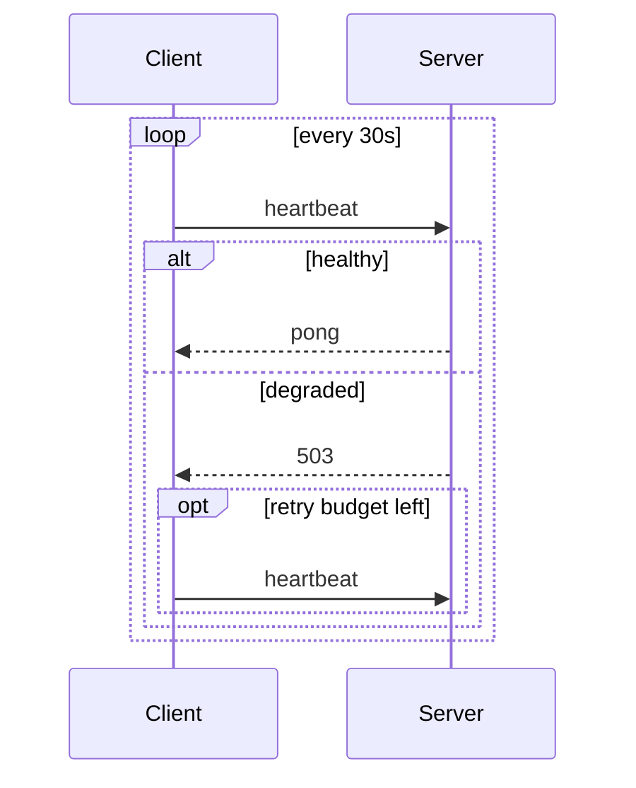
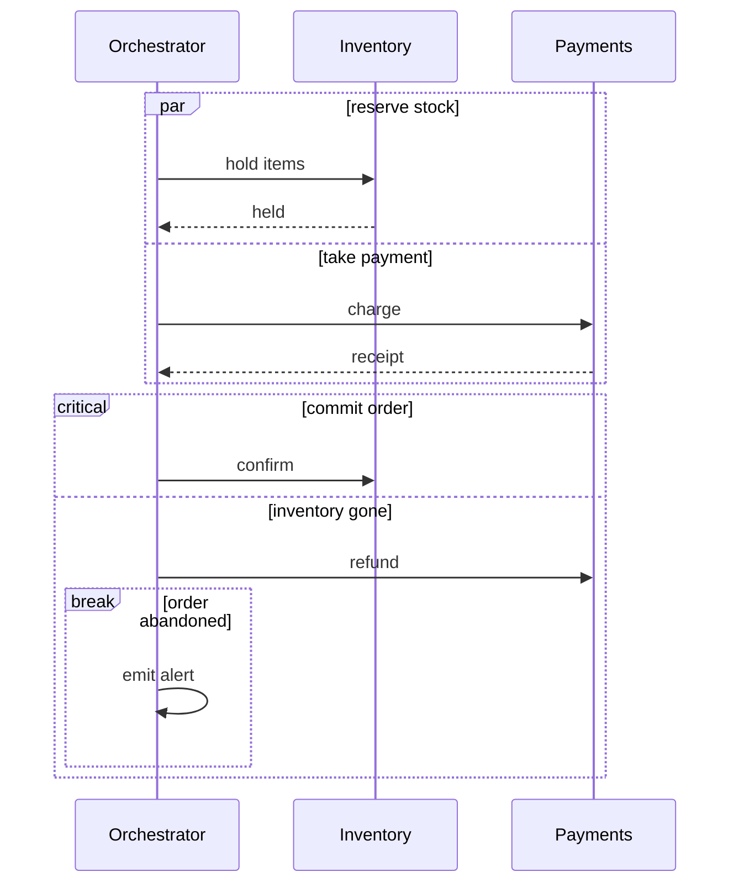
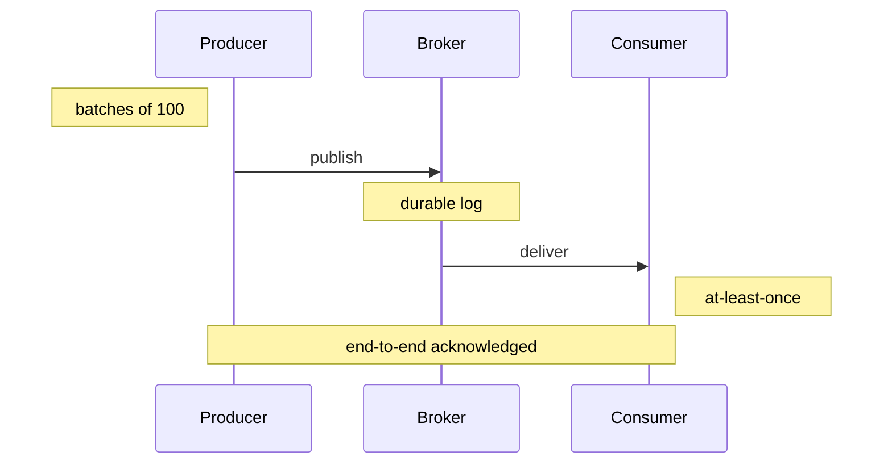
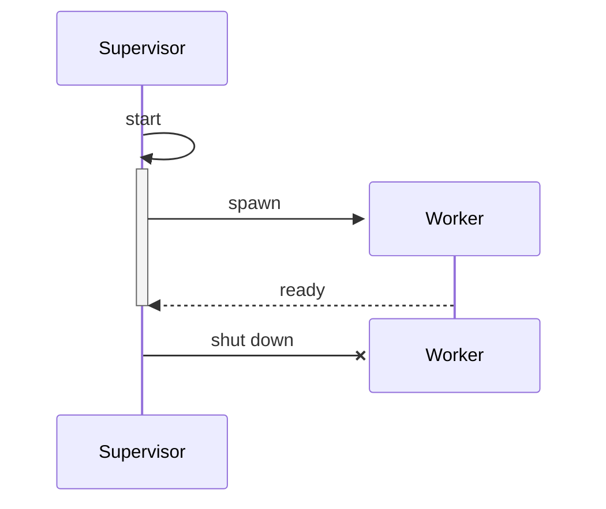
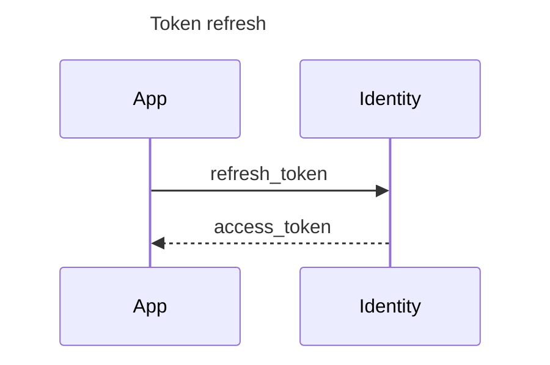

# Sequence diagrams

Sequence diagrams start with `sequenceDiagram`. Participants appear in the
order they are first mentioned, with a header and footer box on each lifeline.

## Participants

Declare participants explicitly to fix their order, and use `as` to give a
lifeline a friendlier label than its identifier:

`actor` is accepted as a synonym, and `box ... end` groups are parsed and
flattened:

## Arrow forms

Every arrow Mermaid defines, solid and dashed:

A message from a participant to itself is drawn as a loop off the lifeline:

## Numbering

`autonumber` prefixes each message with a sequence number:

## Blocks

`loop`, `alt`/`else`, `opt`, `par`/`and`, `critical`/`option`, `break` and
`rect` all draw a labelled frame around the messages they contain:

Frames nest, and `par` runs branches side by side:

## Notes

Notes sit beside a single lifeline or span a range of them:

## Activations and lifecycle

`activate`/`deactivate`, `create` and `destroy` are accepted so that diagrams
copied from elsewhere parse cleanly. Lifelines are drawn for the full height
of the diagram:

## Titles

A `title` line, or a YAML front matter title, is centered above the diagram:

