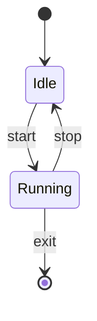
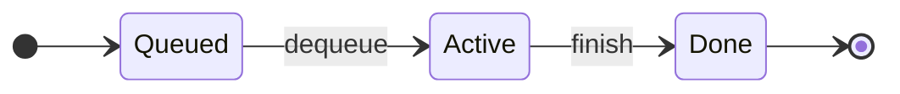
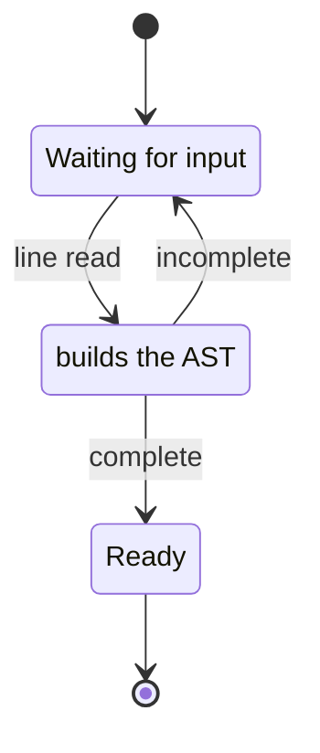
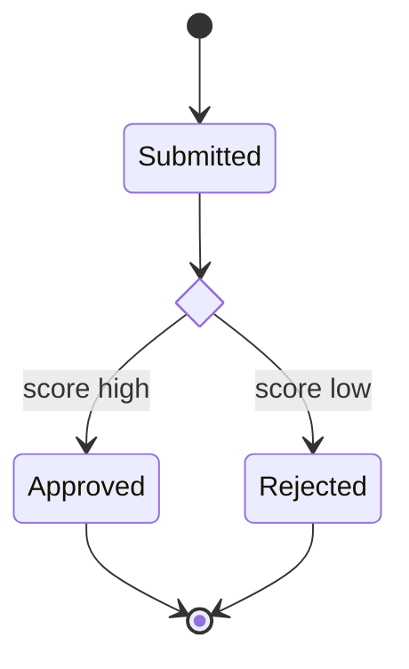
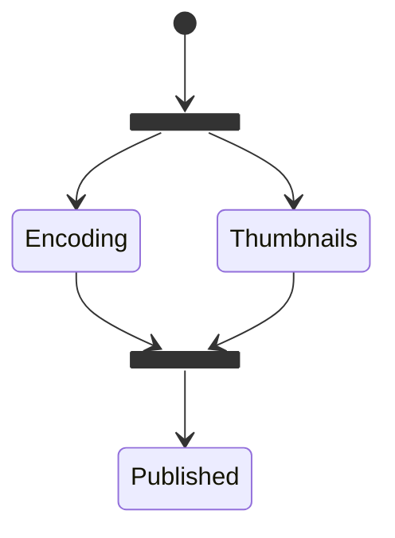
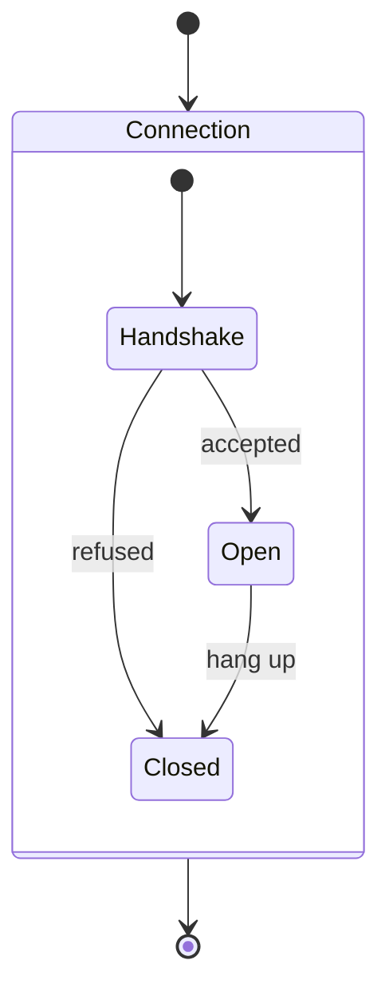
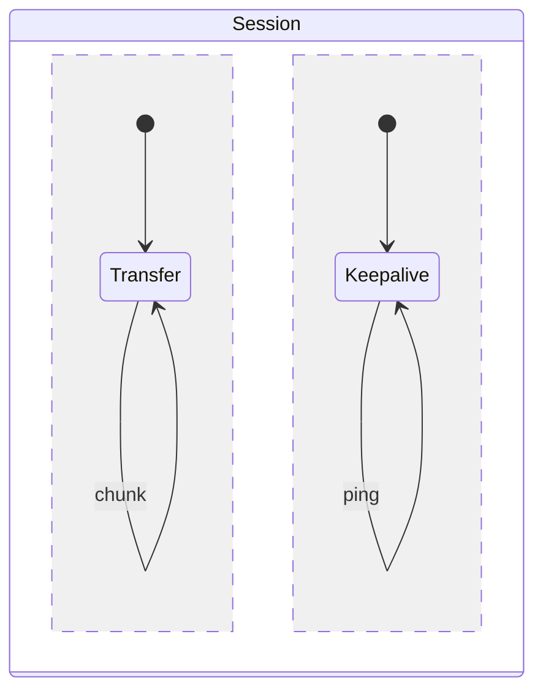
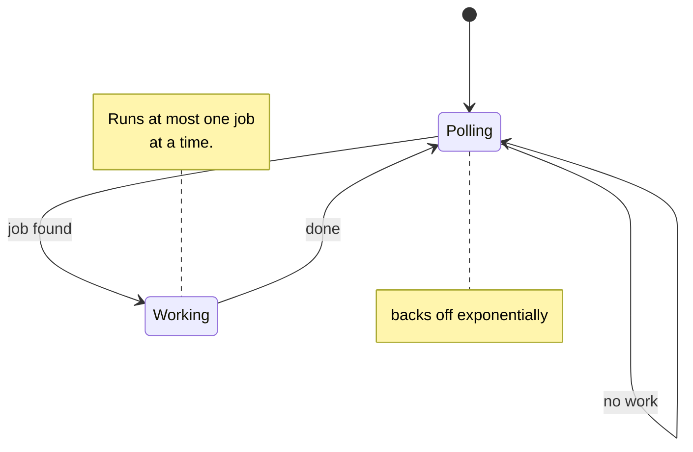
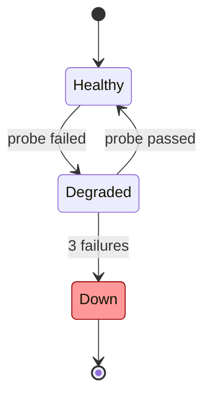

# State diagrams

Both `stateDiagram` and `stateDiagram-v2` are supported. `[*]` marks the start
and end of a region, drawn as `(*)` and `(O)`.

## Transitions

Direction works the same as in flowcharts:

## Naming and descriptions

Quote a name and bind it with `as` when the label is not a valid identifier.
A `State: text` line adds a description below the name:

## Pseudo-states

`<<choice>>` renders as a diamond; `<<fork>>` and `<<join>>` render as bars:

Fork and join split and rejoin concurrent work:

## Composite states

Composite states are flattened — their children are drawn as ordinary states.
Each composite keeps its own start and end markers, so a nested `[*]` belongs
to its own region rather than the diagram as a whole:

Composites nest, and `--` separates concurrent regions within one composite —
each region gets its own start marker:

## Self-transitions and notes

A state may transition to itself. Notes are parsed and omitted from the
drawing, in both the one-line and block forms:

## Styling

`classDef`, `class` and `style` statements are parsed and ignored:

