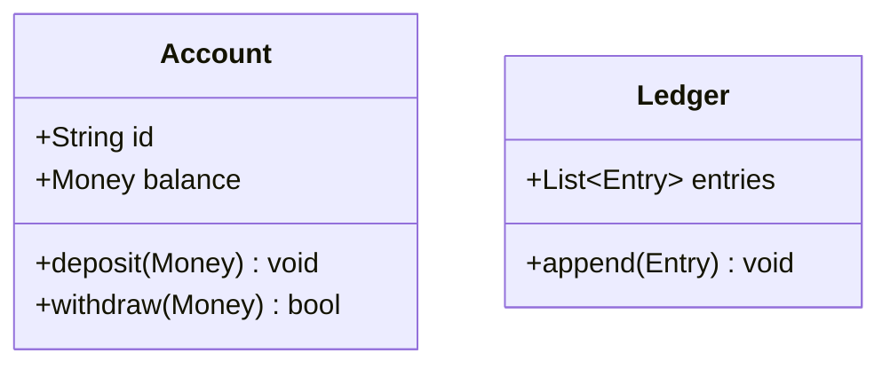
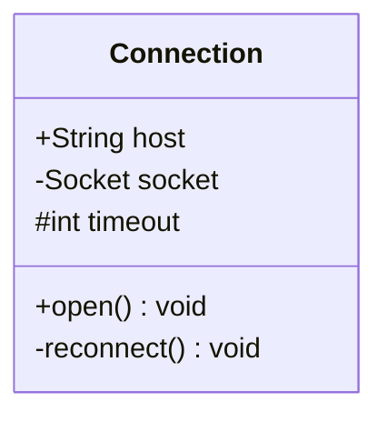
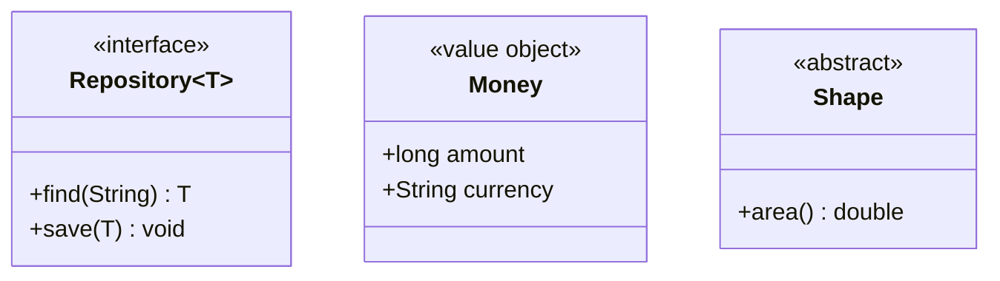
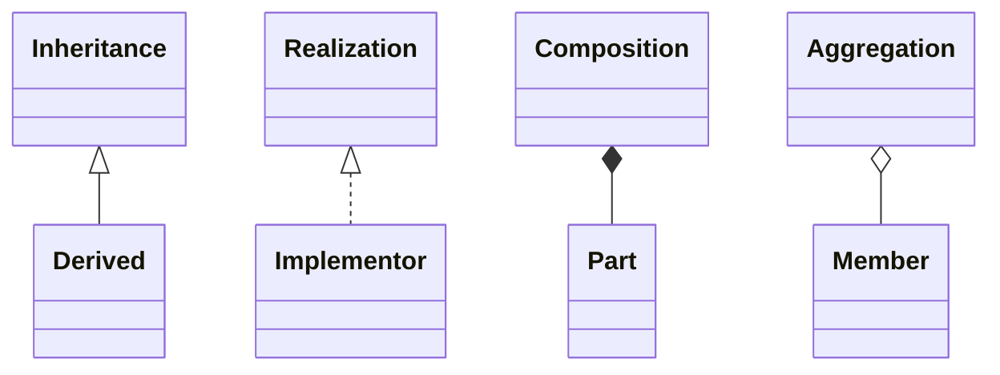
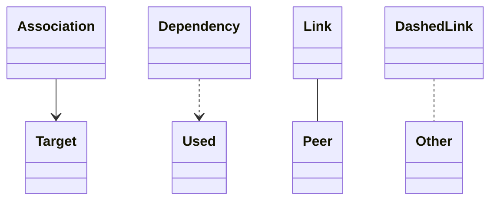
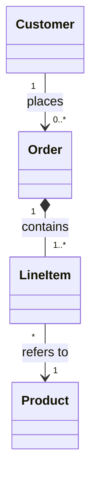
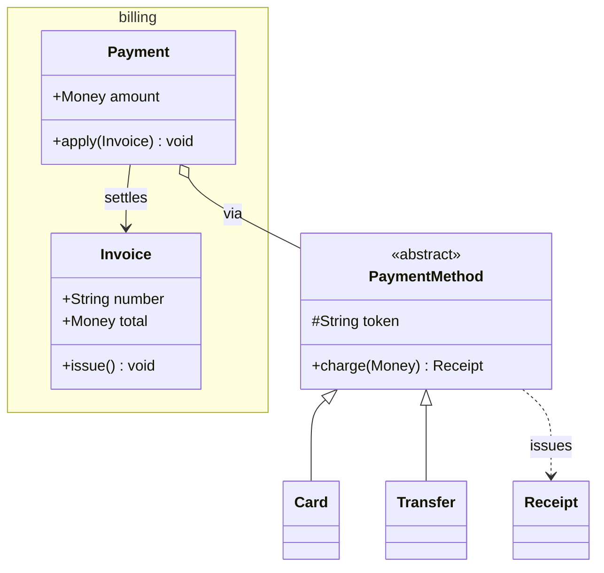
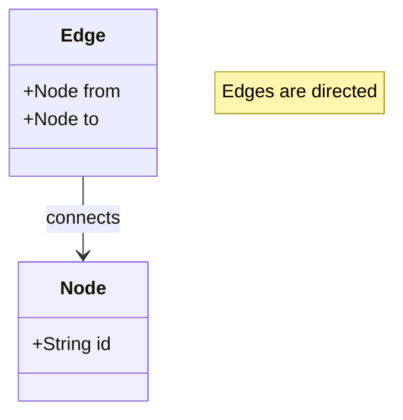

# Class diagrams

Class diagrams start with `classDiagram`. Each class is drawn as a UML box
with compartments for its name, attributes and methods.

## Members

Members can be declared in a block or one at a time with `Class : member`.
Anything containing `()` is treated as a method, everything else as an
attribute:

Visibility markers are kept verbatim: `+` public, `-` private, `#` protected,
`~` package.

## Generics and annotations

`Type~Param~` is displayed as `Type<Param>`. Annotations in `<< >>` sit above
the class name, and may contain spaces:

## Relations

Every relation type, with the marker at either end:

The markers may sit at either end, so `A <|-- B` and `B --|> A` describe the
same inheritance from opposite directions.

Cardinalities and a label describe the relation:

## A worked model

Namespaces are flattened, so their classes are drawn alongside the rest:

## Ignored statements

`style`, `cssClass`, `link`, `click`, `callback` and notes are parsed and
skipped, so diagrams written for the web renderer still work:

