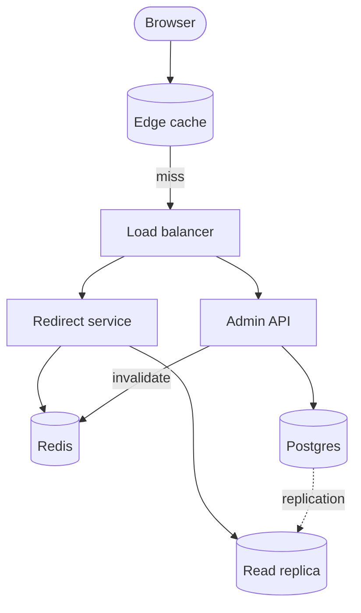
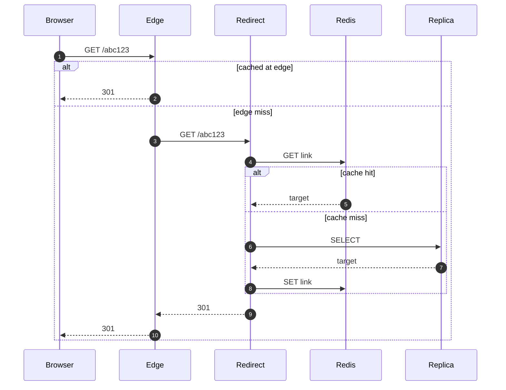
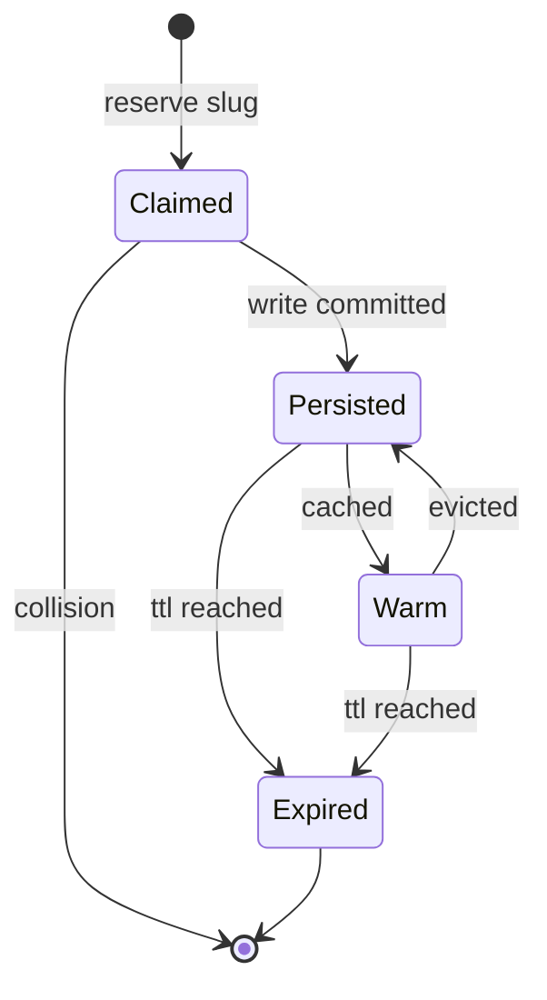
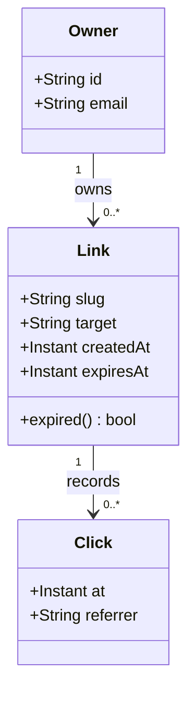

# Architecture review: link shortener

A worked example of the kind of document `md` is meant for: prose, tables
and code interleaved with diagrams, readable end to end in a terminal.

## Context

We serve short links at `s.example.com`. Traffic is **read-dominated** — about
`4000` redirects per second against `12` writes per second — so the design
optimises the read path and accepts eventual consistency on writes.

| Concern | Target | Current |
| --- | --- | --- |
| Redirect latency (p99) | < 30ms | 24ms |
| Write latency (p99) | < 400ms | 310ms |
| Availability | 99.95% | 99.97% |
| Storage | — | 1.4 TB |

## Components



The edge cache absorbs most traffic. Only misses reach the redirect service,
which checks Redis before falling back to the read replica.

## Redirect path



## Link lifecycle

A link is claimed before it is durable, so a collision can be detected without
a write to the primary:



## Domain model



## Decisions

1. **Slugs are generated, not hashed.** A 7-character base62 slug gives
   `62^7` values; collisions are resolved by retrying the claim.
2. **Redis is a cache, never a source of truth.** A cold Redis costs latency,
   not correctness.
3. **Writes go to the primary, reads to a replica.** Replication lag is
   bounded at 2s; a freshly created link is served from the write-through
   cache until it replicates.

```go
func (s *Service) Resolve(ctx context.Context, slug string) (string, error) {
	if url, ok := s.cache.Get(ctx, slug); ok {
		return url, nil
	}
	url, err := s.replica.Lookup(ctx, slug)
	if err != nil {
		return "", err
	}
	s.cache.Set(ctx, slug, url, ttl)
	return url, nil
}
```

## Open questions

- Should expired links return `410 Gone` instead of `404`? See
  [RFC 9110](https://www.rfc-editor.org/rfc/rfc9110).
- Do we need per-owner rate limits on the admin API, or is the global limit
  enough?
