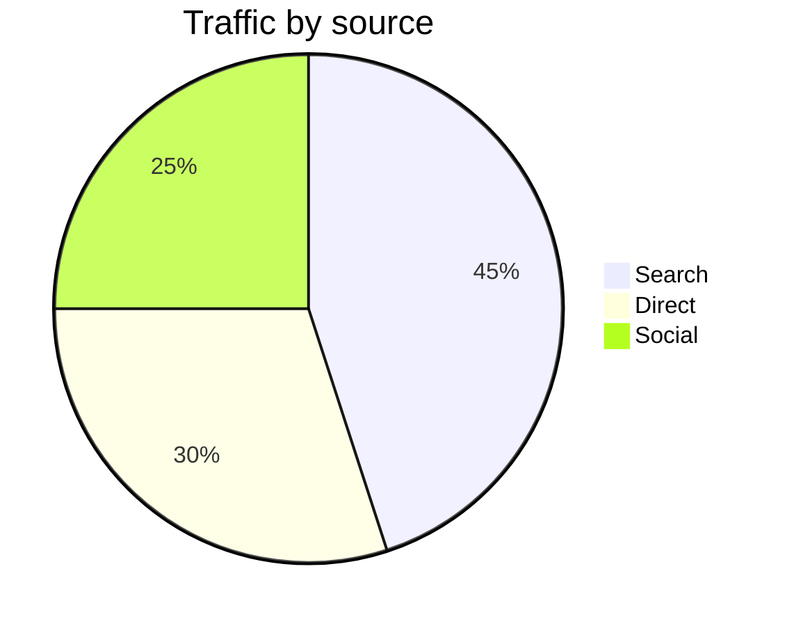
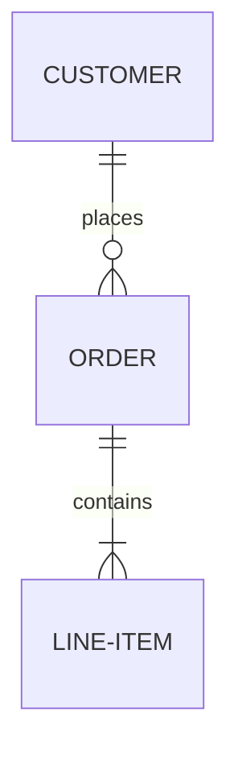

# Fallbacks

`md` renders four diagram types. Anything it cannot draw is left alone as a
plain code block rather than failing, so a document always renders.

## Unsupported diagram types

Gantt charts, pie charts, ER diagrams, journeys, git graphs, mindmaps and the
rest are printed verbatim:






## Malformed diagrams

A diagram of a supported type that cannot be parsed also falls back rather
than aborting the document. Here the node label is never closed:

```mermaid
flowchart TD
  A[unterminated --> B
```

An empty diagram body has nothing to draw:

```mermaid
flowchart TD
```

## Other code blocks

Fences that are not tagged `mermaid` are never read as diagrams, whatever they
contain. A tagged one is syntax highlighted:

```go
func main() {
    // A --> B is just a comment here.
    fmt.Println("hello")
}
```

```
flowchart TD
  A --> B
```

The second block above is an untagged fence, so its Mermaid source is printed
as text rather than drawn — and, having no language, it is left unstyled.

## Prose continues normally

Markdown around a fallback block still renders with **bold**, *italic*,
`inline code`, [links](https://example.com) and tables:

| Diagram | Supported |
| --- | --- |
| `flowchart` / `graph` | yes |
| `sequenceDiagram` | yes |
| `stateDiagram` / `stateDiagram-v2` | yes |
| `classDiagram` | yes |
| everything else | falls back |
